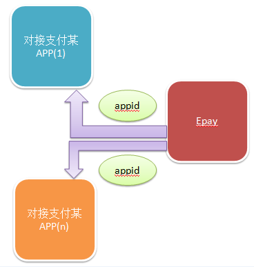
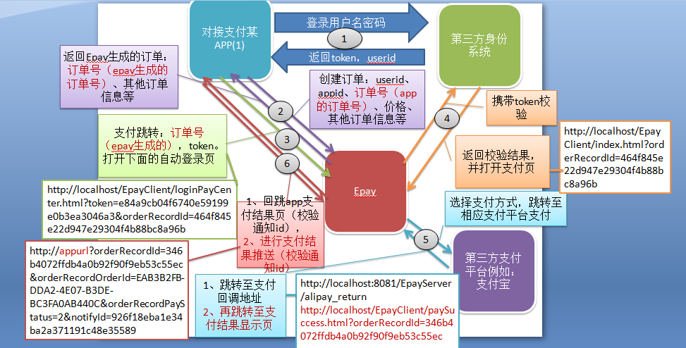

# epay

# epay是一个支付平台。提供，支持对接任何第三方身份系统。

## github 互star 互赞，及此项目问题反馈与答疑QQ群：537982451

### 基于grain RPC框架

https://github.com/dianbaer/grain

	grain-httpserver
	grain-httpclient
	grain-mariadb
	grain-threadmsg
	
	
## 流程图1

## 流程图2

## 项目目录结构：

### EpayServer（目录结构 3276行）

	|--src.main.java（服务器代码）
		|--EpayServer.properties---------------配置文件（需要修改）
		|--generatorConfig.xml--------------------mybatis自动生成配置文件（重新生成时，需要修改）
		|--org.epay
			|--action.IdentityAction.java---------从第三方身份系统获取数据（对接非默认身份系统时，需要修改）
			|--server.Expand.java-------------------扩展启动类
			|--plugin.PaginationPlugin.java-------mybatis自动生成配置文件启动类
			|--http
				|--AlipayNotifyServlet.java-------支付宝异步通知接收类
				|--AlipayReturnServlet.java-------支付宝同步通知接收类
			
		|--com.alipay-----------------------------支付宝调用包
	|--protobuf（消息包生成工具）
	|--WebContent
		|--*.html（请求接口测试）
		|--js（请求接口测试）
		|--html（请求接口测试）

## 打版本：在项目根目录下，执行

	ant

